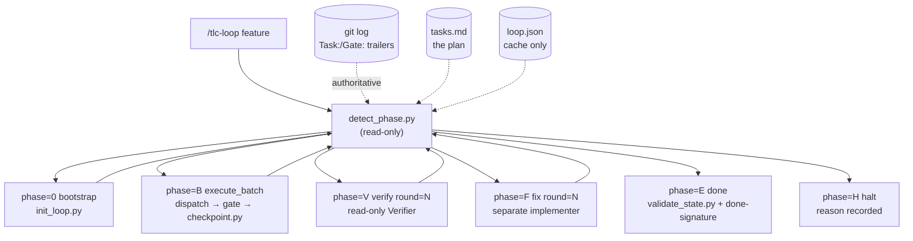
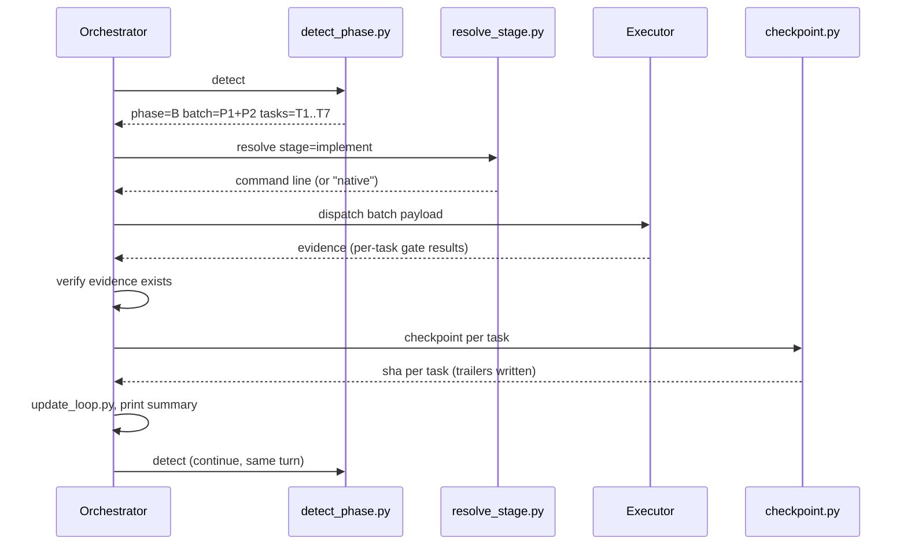

# tlc-loop Design

**Spec**: `.specs/features/tlc-loop/spec.md`
**Context**: `.specs/features/tlc-loop/context.md` (12 locked decisions — D1..D12)
**Status**: Draft

---

## Approach Exploration

All three deliver the same scope. The axis is where determinism lives.

### A — Scripts own every deterministic decision (chosen)

Python scripts decide *what happens next*, *what the state is*, and *what command to run*. `SKILL.md` prose covers only what a script cannot do: writing code, diagnosing a failure, judging a spec.

- **For**: This is the entire reason for porting `cy-loop-tasks`. `tlc-spec-driven`'s own SKILL.md states the principle — *"structural gates are enforced by scripts … so they cannot silently drift when the model forgets a step."* An unattended eight-hour run is exactly where prose-only rules drift.
- **Against**: More scripts to build and test than option B.

### B — Thin scripts, prose control flow

Scripts do state I/O only; `SKILL.md` walks the phase machine in prose.

- **For**: Less code; closest to how `tlc-spec-driven` reads today.
- **Against**: Phase selection becomes model judgment. Resume correctness — the whole point — would rest on the model re-deriving the same answer every time. Rejected.

### C — One driver script owns the loop

- **Against**: Structurally impossible in-turn. Phase B needs a model to write code; a script can only get that by shelling back into an agent. That is exactly `loop.sh`, which is the *external* driver — it cannot be the in-turn motor. Rejected as the primary architecture, kept as the portable restart path.

**Chosen: A.** Everything below assumes it.

---

## Architecture Overview

The skill is a phase machine. Each iteration runs exactly one phase action, then re-enters detection. Git is the source of truth for what is done; `loop.json` caches only what git cannot express.



**Invariant that makes resume work:** `detect_phase.py` never trusts a stored
"current phase". It re-derives the phase every run from git trailers, `tasks.md`,
and `loop.json` counters. Deleting `loop.json` costs counters and the objective,
never task progress.

### Iteration cycle



---

## Code Reuse Analysis

### Sibling skill: `tlc-spec-driven`

Resolved from this skill's own directory via `realpath`, then `../tlc-spec-driven/`.
Both live under `~/.agents/skills/` and are symlinked into `~/.claude/skills/`, so
path resolution must follow symlinks.

| Component | Location | How to Use |
| --- | --- | --- |
| `validate_tasks.py` | `<tlc>/scripts/` | Bootstrap precondition — refuse to start on a `tasks.md` that fails its gate |
| `check_commit.py` | `<tlc>/scripts/` | Called by `checkpoint.py` before every commit; non-zero aborts |
| `validate_state.py` | `<tlc>/scripts/` | Terminal condition for phase E; exit 0 is the only success |
| `lessons.py` | `<tlc>/scripts/` | Verifier distils grounded failures after a FAIL round |
| `implement.md` | `<tlc>/references/` | The per-task cycle a batch worker follows verbatim |
| `validate.md` | `<tlc>/references/` | Verifier operating checklist |
| `sub-agents.md` | `<tlc>/references/` | Batching algorithm (~7 tasks, whole phases) and Verifier contract |
| `coding-principles.md` | `<tlc>/references/` | Shipped in every worker payload |

**Nothing is reimplemented.** The loop sequences and enforces; `tlc-spec-driven`
still defines what a task cycle is.

### Ported from `cy-loop-tasks` (adapted, not copied)

| Source | Adaptation |
| --- | --- |
| `detect-phase.py` contract | Same "print exactly one line" contract; phases and entry conditions rewritten for D2 scope |
| `_state_io.py` | Same strict-codec, single-writer idea for `loop.json` |
| `recovery-loop.md` | Ported nearly whole — it is stack-agnostic already |
| `state-schema.md` invariants | Ported; `completed_tasks` removed (derived from git per D3) |
| `checklist.md` | Ported, rewritten per phase |
| done-signature | Ported as a template; it is the evaluator interface (D11) |
| `herdr-delegation.md` | Generalised into `executors.md` (D7) |

### Integration Points

| System | Integration Method |
| --- | --- |
| git | Task status via commit trailers; `checkpoint.py` writes, `detect_phase.py` reads |
| `tasks.md` | Read-only plan: task IDs, phases, `Depends on`, `Tests`, `Gate` |
| `/goal` (Claude Code) | Consumes the printed done-signature from the transcript |
| codex native goals | Same; `objective` mirrors into its `thread_goals.objective` |
| `loop.sh` | Greps the done-signature / reads `detect_phase.py` output |

---

## Components

### `_state_io.py`

- **Purpose**: Strict read/write codec for `loop.json` — the only module that touches the file.
- **Location**: `scripts/_state_io.py`
- **Interfaces**:
  - `load(feature: str, root: str) -> dict` — parse and schema-validate; raises on malformed
  - `save(feature: str, root: str, state: dict) -> None` — atomic write (temp + rename)
  - `new_state(feature, objective, harness) -> dict`
- **Dependencies**: stdlib `json` only. No hand-written parser: state is JSON, config is TOML via stdlib `tomllib`.
- **Reuses**: `cy-loop-tasks/_state_io.py` structure.
- **Note**: imported, never invoked directly.

### `init_loop.py`

- **Purpose**: Bootstrap — validate preconditions, resolve config, detect harness, write the initial `loop.json`.
- **Location**: `scripts/init_loop.py`
- **Interfaces**: `init_loop.py <feature> --objective "<text>" [--root DIR] [--respawn PROVIDER]`
- **Preconditions checked (all must pass, else exit non-zero with the reason)**:
  1. `git rev-parse --git-dir` succeeds (LOOP-01, edge case)
  2. `.specs/features/<feature>/tasks.md` exists
  3. `<tlc>/scripts/validate_tasks.py` exits 0 on it
  4. `.specs/loop.config.toml` parses, or documented defaults apply
  5. Harness detection resolves, or `respawn.provider` is explicit
- **Dependencies**: `_state_io`, `validate_tasks.py`, `resolve_stage.py` (config parse)
- **Writes**: `loop.json` once. `objective` is immutable from here (D12).

### `detect_phase.py`

- **Purpose**: The single answer to "what happens next". Read-only, no side effects.
- **Location**: `scripts/detect_phase.py`
- **Interfaces**: `detect_phase.py <feature> [--root DIR]` → exactly one line on stdout
- **Output vocabulary**:
  ```
  phase=0 action=bootstrap
  phase=B action=execute_batch batch=P1+P2 tasks=T1,T2,T3,T4,T5,T6,T7
  phase=V action=verify round=N
  phase=F action=fix round=N
  phase=E action=done
  phase=H action=halt reason=<slug> detail="<text>"
  ```
- **Derivation order** (each step can override the previous):
  1. `loop.json` missing → `phase=0`
  2. Halt condition met → `phase=H` (checked before work is dispatched)
  3. `done = git log --format="%(trailers:key=Task,valueonly)"`, deduped
  4. `planned` = task IDs parsed from `tasks.md`, in phase order
  5. `pending = planned - done`; non-empty → `phase=B`, batch packed per `sub-agents.md`
  6. `pending` empty and `validation.md` not PASS → `phase=V` (or `phase=F` when the last verdict was FAIL and gaps are unconsumed)
  7. `validate_state.py` exit 0 → `phase=E`
- **Dependencies**: `_state_io`, git, `tasks.md`, `validate_state.py`
- **Reuses**: batching algorithm from `sub-agents.md`

### `update_loop.py`

- **Purpose**: The only mutator of `loop.json` after bootstrap.
- **Location**: `scripts/update_loop.py`
- **Interfaces**:
  ```
  update_loop.py <feature> --iteration-done --phase B --action "<text>" \
                 [--task-started TN | --task-done TN] \
                 [--verify-round <PASS|FAIL>] [--gate-attempt TN] \
                 [--halt <reason> --detail "<text>"] [--root DIR]
  ```
- **Invariants**: increments `iteration` once per call; `iterations[]` append-only, capped at 50; `objective` rejected as a write target; counters for the runaway detectors updated here.
- **Dependencies**: `_state_io`

### `checkpoint.py`

- **Purpose**: Create the atomic per-task commit with its trailers (LOOP-02).
- **Location**: `scripts/checkpoint.py`
- **Interfaces**: `checkpoint.py <feature> --task TN --gate <quick|full|build> --message "<conventional commit>" [--root DIR]`
- **Behaviour**:
  1. Refuses unless the caller asserts a passing gate (`--gate-result PASS` required)
  2. Validates the message with `check_commit.py`; non-zero aborts before staging
  3. Stages the task's files plus `tasks.md` / `spec.md` traceability updates
  4. Commits with `--trailer "Task: TN" --trailer "Gate: <level> PASS"`
  5. Prints the short SHA, or `SKIP: no changes` when the task legitimately produced no diff
- **Never** uses `--no-verify`.
- **Dependencies**: git, `check_commit.py`

### `resolve_stage.py`

- **Purpose**: Turn `provider` / `model` / `effort` into a concrete invocation (LOOP-05).
- **Location**: `scripts/resolve_stage.py`
- **Interfaces**:
  - `resolve_stage.py --stage implement [--root DIR]` → `kind=command cmd="codex exec -m … "` or `kind=agent model=opus effort=high`
  - `resolve_stage.py --validate` → exit non-zero listing every unsupported `effort`/provider pair
- **Behaviour**: rejects an `effort` the target provider does not accept **before** dispatch; when `provider` equals the running harness, returns `kind=agent`.
- **Dependencies**: `loop.config.toml`, the adapter table in `references/providers.md`

### `loop.sh`

- **Purpose**: Portable restart driver for harnesses without a native goal mechanism (D9).
- **Location**: `scripts/loop.sh`
- **Behaviour**: loops `detect_phase.py`; breaks on `phase=E` or `phase=H`; otherwise spawns the `continue.respawn` agent resolved through `resolve_stage.py`.
- **Dependencies**: `detect_phase.py`, `resolve_stage.py`

### Prose references

| File | Contents |
| --- | --- |
| `SKILL.md` | Phase branches, critical rules, invocation |
| `references/phase-transitions.md` | `detect_phase.py` contract, entry conditions, exit rules |
| `references/recovery-loop.md` | Repair procedure, normative failure classifications, external-blocker test |
| `references/executors.md` | Payload format, evidence contract, the two universal executor rules |
| `references/providers.md` | Adapter table (below) |
| `references/state-schema.md` | `loop.json` schema and invariants |
| `references/config-schema.md` | `loop.config.toml` schema and defaults |
| `references/checklist.md` | Per-iteration self-audit |

| Asset | Contents |
| --- | --- |
| `assets/loop.config.example.yaml` | Commented starter config |
| `assets/iteration-summary.template.md` | Summary block printed per iteration |
| `assets/goal-condition.template.md` | Ready-made `/goal` condition text anchored on the done-signature |

---

## Data Models

### `loop.json` — machine-owned, single writer

Stdlib `json`, written with `indent=2` and sorted keys so diffs stay readable.

```json
{
  "feature": "auth-refresh",
  "created_at": "2026-08-08T12:00:00Z",
  "last_updated": "2026-08-08T14:31:07Z",
  "objective": "ship auth-refresh end to end",
  "status": "active",
  "iteration": 14,
  "harness_resolved": "claude",

  "current_batch": ["T8", "T9", "T10", "T11", "T12", "T13", "T14"],
  "current_task": "T11",
  "no_diff_tasks": ["T4"],

  "verify": {
    "rounds": 1,
    "last_verdict": "FAIL",
    "last_report": ".specs/features/auth-refresh/validation.md",
    "gaps_open": 2
  },

  "counters": {
    "started_at_ms": 1786000000000,
    "iterations_without_commit": 0,
    "gate_attempts": { "T11": 2 }
  },

  "halt": { "reason": null, "detail": null },

  "iterations": []
}
```

| Field | Meaning |
| --- | --- |
| `objective` | Immutable after bootstrap (D12); `update_loop.py` rejects writes to it |
| `status` | `active` \| `blocked` \| `halted` \| `complete` |
| `harness_resolved` | Result of auto-detection at bootstrap (D10) |
| `current_task` | Started but not yet committed; `null` between iterations |
| `no_diff_tasks` | Tasks that legitimately produced no diff, so carry no git trailer; unioned with git trailers by `detect_phase.py` |
| `halt.reason` | `no_progress` \| `gate_stuck` \| `executor` \| `limit` \| `blocker` \| `blast_radius` |
| `iterations` | Append-only, capped at the last 50 |

**Deliberately absent:** `completed_tasks`. Derived from git trailers every run
(D3). This is what makes the file disposable.

### `.specs/loop.config.toml` — user-owned, read-only to the loop

Stdlib `tomllib`. TOML rather than YAML because it parses with zero dependencies
and zero hand-written code, and it is the format `~/.codex/config.toml` already
uses. TOML has no `null`: **an omitted limit means unlimited** (D8).

```toml
version = 1

[stages.implement]
provider = "codex"
model = "gpt-5.6-luna"
effort = "max"

[stages.verify]
provider = "claude"
model = "opus"
effort = "high"

[stages.fix]
provider = "codex"
model = "gpt-5.6-luna"
effort = "max"

[execute]
batch_size = 7

[verify]
max_rounds = 3              # no hard ceiling (D5)

[continue]
in_turn = true
mode = "auto"               # auto | goal | shell | none

[continue.respawn]
provider = "auto"           # detected at bootstrap; explicit always wins (D10)
model = "opus"
effort = "high"

[limits]                    # omit a key for unlimited (D8)
no_progress_iterations = 3
gate_attempts_per_task = 3
executor_timeout_seconds = 1800
# max_iterations = 200
# max_minutes = 480

# [providers.myagent]       # optional: extra CLIs or command overrides
# kind = "command"
# command = "myagent run --model {model} --out {evidence}"
```

### Provider adapter table

Effort support marked **[v]** where verified against the installed CLI in this
session, **[?]** where inferred and pending the discovery task (T-discovery).

| provider | kind | invocation | effort mechanism | evidence capture |
| --- | --- | --- | --- | --- |
| `claude` | `agent` when orchestrator is Claude Code, else `command` | `claude -p --model {model} --permission-mode {perm} --output-format stream-json` **[v]** | separate field **[v]** | stdout (stream-json) |
| `codex` | `command` | `codex exec -m {model} -c model_reasoning_effort={effort} --cd {repo} -o {evidence}` **[v]** | `-c model_reasoning_effort` **[v]** | `-o/--output-last-message` file **[v]** |
| `cursor` | `command` | `cursor-agent -p --force --model {model}{-effort} --output-format json` **[v]** | baked into the model name, or bracket syntax `'model[effort=high]'` **[v]** | stdout (json) |

Accepted `effort` values per provider:

| provider | accepted |
| --- | --- |
| `claude` | `low, medium, high, xhigh, max` **[v]** |
| `codex` | `xhigh, max` **[v]** (seen in `~/.codex/config.toml`); `low, medium, high` **[?]** |
| `cursor` | `low, medium, high, xhigh` **[v]** (from `--list-models` suffixes) |

`ultra` is accepted by none and is rejected by `resolve_stage.py --validate`.

---

## Error Handling Strategy

| Error Scenario | Handling | User Impact |
| --- | --- | --- |
| Gate fails on a task | Repair loop inside the phase action; state untouched | Nothing; the run continues |
| Same task's gate fails > `gate_attempts_per_task` | `phase=H reason=gate_stuck` | Run stops with the task named |
| No commit across `no_progress_iterations` | `phase=H reason=no_progress` | Run stops; likely a detect bug |
| Executor CLI missing / auth expired / quota | `phase=H reason=executor` with the command named | Change provider in config, re-invoke |
| Executor claims done without evidence | Phase stays open; evidence re-collected or lane re-run | Nothing; the run continues |
| Executor commits despite the ban | Phase stays open, work preserved, checkpoint ownership repaired | Reported, run does not advance |
| `loop.json` malformed | `_state_io` raises; `detect_phase.py` prints `phase=H reason=state_corrupt` with the parse error as detail | Loud halt in the same phase vocabulary, never silent reconstruction — rebuilding would discard the immutable objective |
| `loop.json` deleted | Rebuilt from git + `tasks.md`; counters and objective lost | Run resumes at the right task |
| Uncommitted changes mapping to no task | `phase=H reason=blocker` | Stops and asks; never discards |
| Duplicate `Task:` trailer after rebase | Deduped, first commit wins, ambiguity recorded | Nothing |
| Push / deploy / migration required | `phase=H reason=blast_radius` | Waits for explicit authorization |
| External blocker proven (3 criteria) | `status: blocked`, evidence recorded, no done-signature | Stops with the missing input named |

---

## Risks & Concerns

| Concern | Location | Impact | Mitigation |
| --- | --- | --- | --- |
| Sibling-path resolution across symlinks — `~/.claude/skills/tlc-spec-driven` is a symlink to `~/.agents/skills/tlc-spec-driven` | skill bootstrap | Every reused script becomes unreachable; the loop cannot start | Resolve with `realpath` on this skill's own file, then `../tlc-spec-driven/`; fail loudly with the attempted path. Dedicated task with a test |
| The other three tlc validators were never mutation-tested | `<tlc>/scripts/validate_tasks.py`, `check_commit.py`, `validate_state.py` | We depend on gates that may pass vacuously, exactly as `validate_spec.py` did | Dedicated task: feed each a deliberately invalid input and assert non-zero. Same method that found the `validate_spec.py` defect |
| `command` executors run non-interactively with auto-approval | `references/executors.md` | An unattended agent with `--force` / `--dangerously-skip-permissions` can do real damage | Blast-radius halt is *halt*, not *ask* — asking is useless with nobody watching. Documented as a required precondition, not a default |
| Non-interactive executor can hang with no output | `resolve_stage.py` dispatch | A silent hang looks identical to slow work; the run stalls until a human notices | Per-invocation timeout in config; timeout counts as an executor failure and halts |
| `tasks.md` has no status field, so a human tick and git can disagree | `tasks.md` | Confusion about what is done | Git wins by design (LOOP-01 AC 4); reconciliation is recorded, never silent |
| Tasks with no diff (config-only) under trailer-based status | `checkpoint.py` | A task could complete without producing a trailer, so `detect_phase` re-runs it forever | `SKIP: no changes` path records completion in `loop.json`; `detect_phase` unions git trailers with that list. Explicit task + test |
| Batch worker context could exceed budget on a coarse phase | `sub-agents.md` batching | Worker degrades or truncates | Reuse the existing coarse-phase caveat: a phase over ~1.5× budget is a Tasks-authoring smell, surfaced at bootstrap |

---

## Tech Decisions

Only the non-obvious ones. The twelve locked decisions live in `context.md`.

| Decision | Choice | Rationale |
| --- | --- | --- |
| Serialisation formats | Config in TOML (`tomllib`), state in JSON (`json`) — both stdlib | The zero-dependency rule ruled out PyYAML, and the alternative was a hand-written YAML subset reader plus emitter: the riskiest component in the design, for no user-visible gain. `tomllib` has been stdlib since 3.11, TOML is human-editable, and it is already the format of `~/.codex/config.toml`. Cost: TOML has no `null`, so an omitted limit key means unlimited |
| Tracking tasks that produce no diff | `no_diff_tasks` list in `loop.json`, unioned with git trailers | A config-only task leaves no commit, so a trailer-only derivation would re-run it forever. The list is the one piece of completion state git cannot express, and it is regenerated from the run rather than being authoritative |
| Fix as its own phase (`F`) rather than a step inside `V` | Separate phase | Makes author ≠ verifier visible in the detect output, and lets the two run on different providers per D6 — impossible if they share a phase |
| Halt as a phase (`H`) rather than an exit code | Phase | `loop.sh`, `/goal`, and the in-turn motor all read one contract. A halt reason in the same vocabulary means one parser, not three |
| Batch identity in the detect line | Phase labels plus explicit task IDs | Phase labels alone are ambiguous after a `tasks.md` edit; explicit IDs make the dispatch auditable in the transcript the evaluator reads |
| Done-signature carries the feature name | `__TLC_LOOP__ feature=<f> verify=PASS` | Two concurrent features in one transcript would otherwise satisfy each other's goal condition |
| Where `no_progress` is counted | `update_loop.py`, not `detect_phase.py` | `detect_phase.py` must stay side-effect free so it can be run freely for inspection |

> **Project-level decisions:** none yet promoted to `.specs/STATE.md`. The
> sibling-resolution convention becomes `AD-001` if a second skill in this repo
> needs it.
